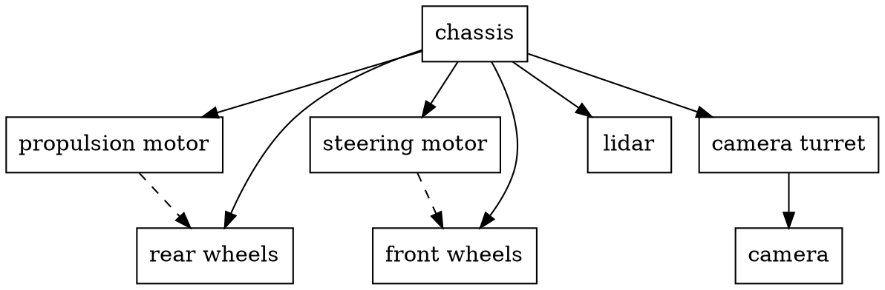
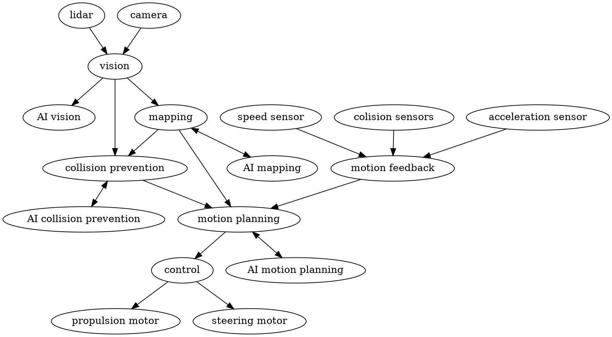

This is a robot that represents a self-driven car. It has four wheels, front-wheel streering using servo-motor, rear-drive brushless DC motor, camera, lidar, speed sensor and acceleration sensor.



Conceptual controll diagram:


ccu - central controll unit

Carbot contains folowing packages:

# carbot_description

# carbot_control

The ```carbot_control``` package, responsible for motor control (propulsion and steering), should include one or more ROS 2 nodes. Each node within the ```carbot_control``` package can represent a specific aspect of motor control or functionality, making it easier to modularize and manage your control logic.

Here's how you can structure the carbot_control package:

carbot_control Package:

Create a ROS 2 package named carbot_control.
ROS 2 Nodes:

Implement one or more ROS 2 nodes within the carbot_control package. Each node should focus on a specific aspect of motor control, such as propulsion or steering.
For example, you can have nodes like propulsion_controller and steering_controller.
Functionality and Responsibilities:

Define the responsibilities of each node:
propulsion_controller: Handles motor control for propulsion, including setting motor velocities, monitoring encoders, and ensuring linear motion.
steering_controller: Controls the steering motor, setting the desired steering angle, and ensuring the robot follows the desired path or direction.
Node Communication:

Nodes within the carbot_control package may need to communicate with each other or with other nodes in the system.
For example, the propulsion_controller node might communicate with the steering_controller to coordinate motion, or both nodes might subscribe to a topic that provides high-level motion commands from another node (e.g., a motion planning node).
Parameter Configuration:

Use ROS 2 parameters to configure control parameters, such as motor gains, control loop parameters, and hardware-specific settings. You can include these parameters in your node's configuration YAML files.
Testing and Debugging:

Implement unit testing for individual nodes within the carbot_control package to ensure that they perform their tasks correctly.
Include debugging and logging mechanisms to facilitate troubleshooting and monitoring of control behavior.
Launch Files:

Create ROS 2 launch files within the carbot_control package to start and configure your control nodes.
These launch files can be used to specify node parameters, load configuration files, and launch the necessary hardware interfaces.
By organizing the carbot_control package with ROS 2 nodes, you can achieve modularity and maintainability in your control logic. Each node focuses on a specific aspect of motor control, making it easier to understand, test, and update your control algorithms independently. This approach also aligns with the ROS 2 architecture, where nodes perform specific tasks and communicate with each other to achieve the desired robot behavior.
